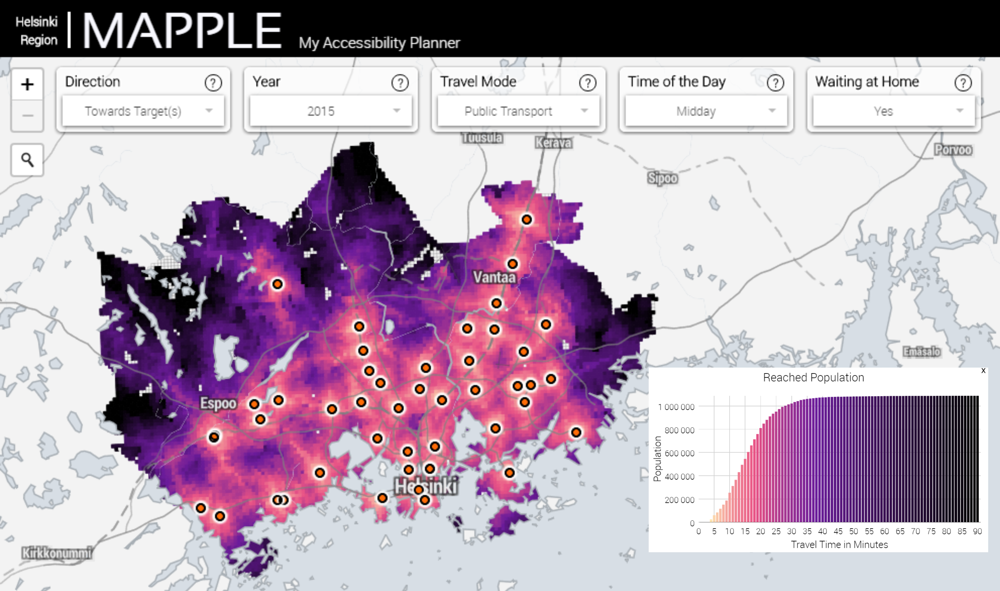

# Mapple

**[Mapple](http://86.50.170.183:8080)** (My Accessibility Planner) is a map application that makes it easy to explore how you can reach important and interesting places for you by
different travel modes. With Mapple you can easily create an interactive map that shows the travel times to a location of your interest and the amount of
people it reaches e.g. in 30 minutes.

Mapple makes it easy to compare different travel modes to each other (public transport, private car, walking), and download the data of your analysis into
your computer for further inspection. Mapple is an ideal tool e.g. for a citizen trying to find a good location for a new home that is close enough to his/her
important places, or for a entrepreneur who tries to find a good location for a new store with enough potential customers living close by.

## How does it work?

### Running the analysis

-  Select location(s) from the map:

   - You can select a location by clicking with left mouse.
   - You can select multiple locations simultaneously by activating Select multiple targets -button.
   - You can also find your desired location(s) based on address with the Address search -button.
   - You can also select some basic services as your targets from the Show services -button on the upper right corner.

-  Select the direction of travel, travel mode and the time of the day using the buttons at the top.

-  Run the analysis and visualize your accessibility map by pressing GO!

### After the analysis, you can...

-  See the travel time information for specific location by clicking with right mouse button.

-  See the amount of people reaching your target(s) within specific amount of time by pressing the graph -button (tähän kuva siitä) on the right.

-  Save the results of your accessibility map by pressing the Download query results -button.

-  You can select new locations on top of the current ones.

-  Reset the map by pressing Reset -button.

### Navigation

-  You can zoom in and out on the map using your mouse scroll or using the touch pad.

-  You can move around the map by holding the left button of your mouse.

-  You can find information about a location by pressing right mouse.

## For what can I use this for?

Mapple can be used for many different purposes. Here you can find examples from the perspectives of a [citizen](#citizens-perspective), 
[entrepreneur](#entrepreneurs-perspective) and a [planner](#planners-perspective).

### Citizens' perspective

- *"How long does it take to reach the nearest library from my home by walking?"*
- *"How long does it take from my new appartment to reach my workplace or visit my grandma?"*
- *"How many people live near my home?"*

Mapple can be used for finding out how much time does it take to reach important places of a citizen in his/her city.
A citizen can also use the application to find out suitable places for a new place to live where the travel times to important
places are close enough.

### Entrepreneurs' perspective

- *"How many people does my shop(s) reach within 30 minutes by car? Whatabout with public transportation or walking?"*
- *"From which areas are people most likely coming to my service if they are using public transportation and are willing to use 15 minutes for travelling?"*
- *"I am planning to open a new location for my store. Where should I locate it to? It should have enough people living within 20 minutes from my store."*

Mapple can be used for finding out easily how many people can reach within a specific amount of time a shop or service. It can be used to also explore
potential areas or places for opening up a new business.

### Planners perspective

- "How many people live over 30 minutes from the nearest health care center using public transporation?"
- "Does there exist service gaps in Helsinki Region where citizens cannot reach important services fast enough?"
- "Is there enough people in this area that can reach this place within 5 minutes of walking so that I should plan two playgrounds instead of one into this area?"

Mapple can also help for doing "better" planning decisions. It can be used e.g. to find out potential places where the service level is inadequate and where the
new services should be allocated.

## Data and licence

Mapple uses only open data. The travel time information is based on [Helsinki Region Travel Time Matrix](http://www.hri.fi/en/dataset/paakaupunkiseudun-matka-aikamatriisi)
data (2013 & 2015) that is produced by the [Accessibility Research Group](http://www.helsinki.fi/science/accessibility) at the University of Helsinki.
Population data (2015) is based on [Population grid](http://www.hri.fi/en/dataset/vaestotietoruudukko) produced
Helsinki Region Environmental Services Authority HSY.

All datasets are licenced with [Creative Commons 4.0 BY licences](https://creativecommons.org/licenses/by/4.0/).

## Copyright

Mapple - My Accessibility Planner.
Copyright (C) 2017 HaaHaaMap - All Rights Reserved. 

## Technical documentation

You can read the technical documentation separately from [here](docs/tech-specs.md).

## Developers

- **Rami Piiroinen**
- **Joona Repo**
- **Henrikki Tenkanen**

## Contact

You can contact us via email:

- haahaamap (a) gmail.com